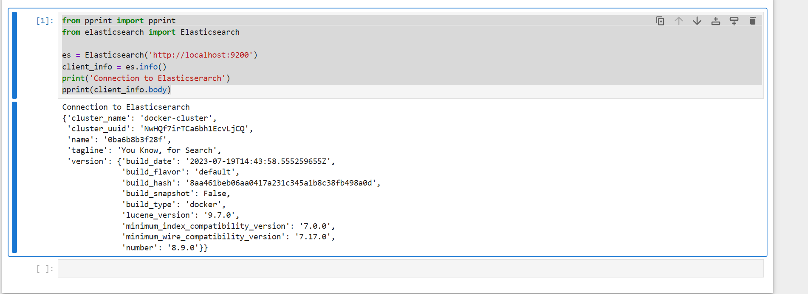
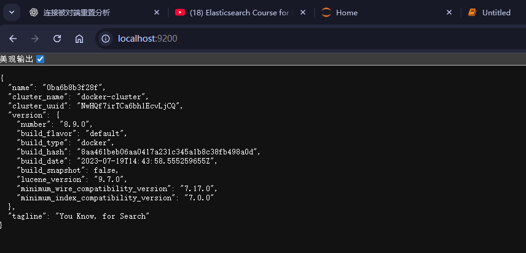
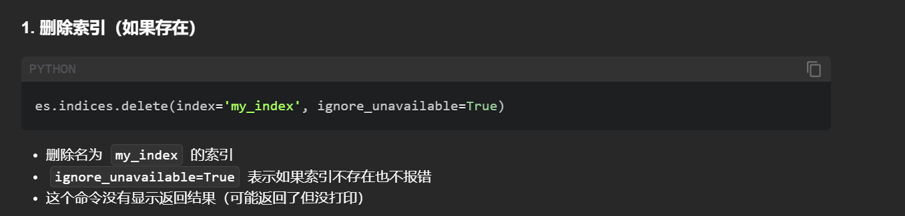
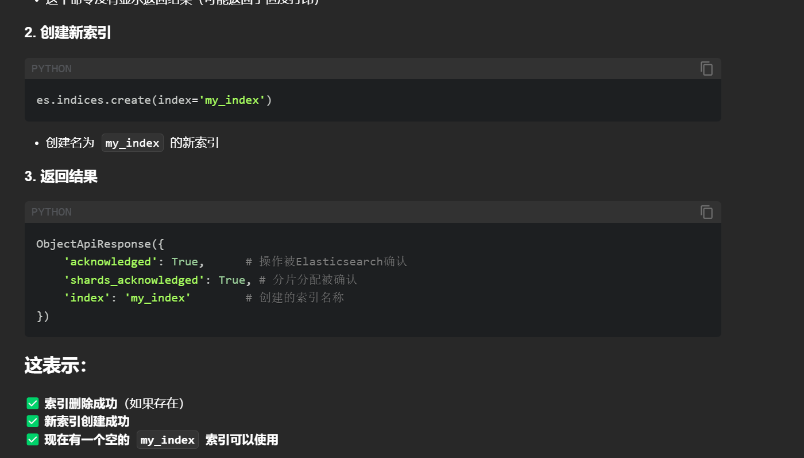
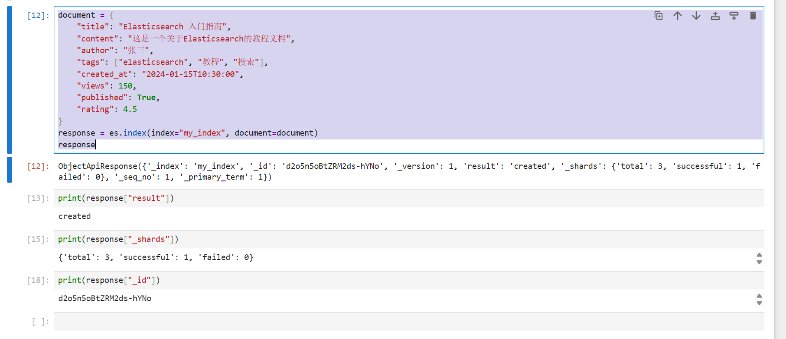

# 本地开容器
```sh
docker run -d --name elasticsearch \
  -p 9200:9200 -p 9300:9300 \
  -e "discovery.type=single-node" \
  -e "xpack.security.enabled=false" \
  docker.elastic.co/elasticsearch/elasticsearch:8.9.0
```

```sh
docker run -d --name kibana \
  -p 5601:5601 \
  -e "ELASTICSEARCH_HOSTS=http://elasticsearch:9200" \
  --link elasticsearch:elasticsearch \
  docker.elastic.co/kibana/kibana:8.9.0

```

# jupyter notebook . 启动，安装
```sh
# 查看当前安装的 elasticsearch 包版本
pip show elasticsearch

# 安装与 Elasticsearch 8.9.0 兼容的版本
pip install elasticsearch==8.9.0
```
# python 测试
```py
from pprint import pprint
from elasticsearch import Elasticsearch

es = Elasticsearch('http://localhost:9200')
client_info = es.info()
print('Connection to Elasticserarch')
pprint(client_info.body)
```


# Elasticsearch 连接信息总结

| **类别** | **字段名** | **值** | **说明** |
|----------|------------|--------|-----------|
| **连接状态** | - | Connection to Elasticsearch | Python客户端成功连接到Elasticsearch服务 |
| **集群信息** | cluster_name | docker-cluster | Elasticsearch集群名称 |
|  | cluster_uuid | NwHQf7irTCa6bh1EcvLjCQ | 集群唯一标识符 |
| **节点信息** | name | 0ba6b8b3f28f | 当前节点名称（容器ID） |
| **标语** | tagline | You Know, for Search | Elasticsearch官方标语 |
| **版本信息** | number | 8.9.0 | Elasticsearch主版本号 |
|  | build_flavor | default | 构建类型（默认版本） |
|  | build_type | docker | 通过Docker容器方式部署 |
|  | lucene_version | 9.7.0 | 底层Lucene搜索引擎版本 |
|  | build_date | 2023-07-19T14:43:58.555259655Z | 软件构建日期 |
|  | build_hash | 8aa461beb06aa0417a231c345a1b8c38fb498a0d | 构建版本哈希值 |
|  | build_snapshot | False | 非快照版本（正式版） |
| **兼容性** | minimum_wire_compatibility_version | 7.17.0 | 最低网络通信兼容版本 |
|  | minimum_index_compatibility_version | 7.0.0 | 最低索引兼容版本 |


# 实际上和我们本上打开这个网址的返回是一样的


# 删除索引
```python
es.indices.delete(index='my_index', ignore_unavailable=True)
```

# 创建index 
```python
es.indices.create(index='my_index')
```



# 创建索引的同时可以指定分片数量`numbers_of_shards`及备份数量`number_of_replicas`


```python
es.indices.delete(index='my_index',ignore_unavailable=True)
es.indices.create(
    index='my_index',
    settings={
        "index":{
        "number_of_shards":3,
        "number_of_replicas":2
     }
    }
)
```
# 通过document的方式而非create,会自动检查该索引存在还是不存在的
```python
document = {
    "title": "Elasticsearch 入门指南",
    "content": "这是一个关于Elasticsearch的教程文档",
    "author": "张三",
    "tags": ["elasticsearch", "教程", "搜索"],
    "created_at": "2024-01-15T10:30:00",
    "views": 150,
    "published": True,
    "rating": 4.5
}
response = es.index(index="my_index", document=document)
response
```


#