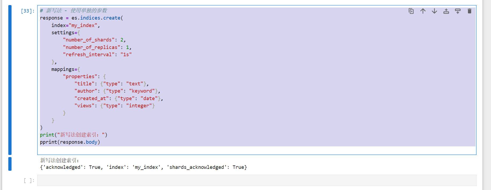
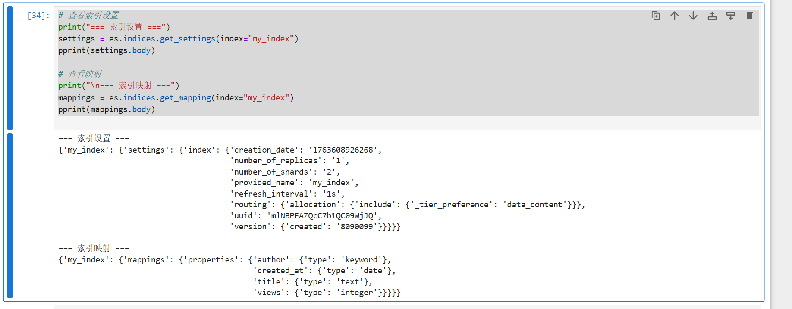
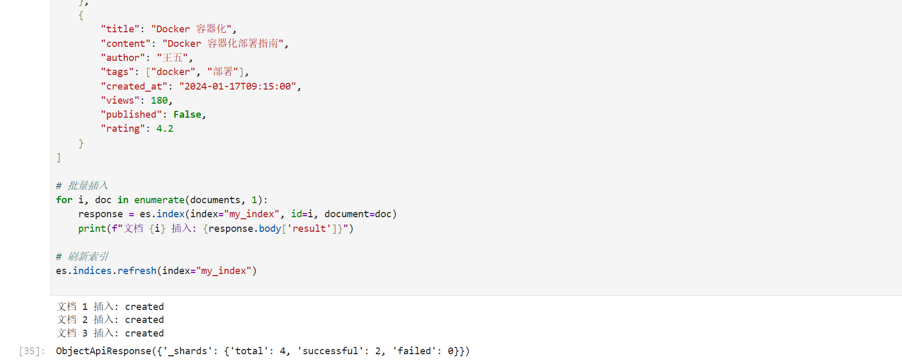
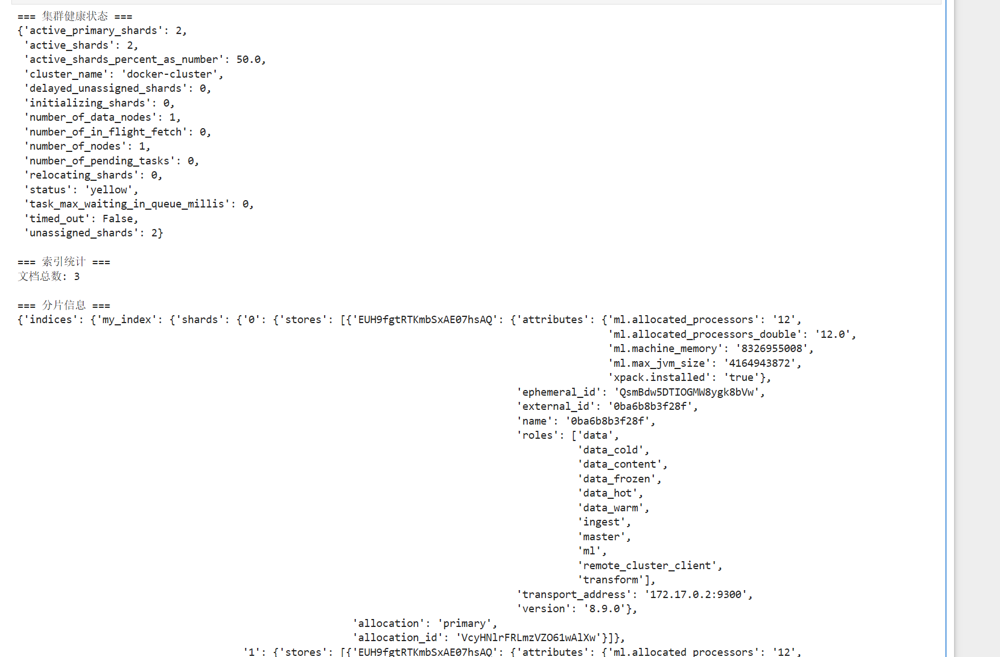
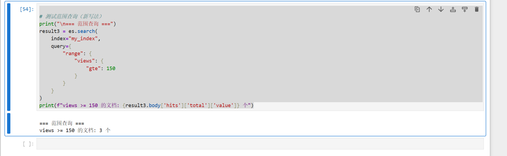

# `es.indices.delete(index='my_index', ignore_unavailable=True)`删除之前的索引

# 像typescript一样，指定数据类型
```python
es.indices.delete(index='my_index', ignore_unavailable=True)
# 新写法 - 使用单独的参数
response = es.indices.create(
    index="my_index",
    settings={
        "number_of_shards": 2,
        "number_of_replicas": 1,
        "refresh_interval": "1s"
    },
    mappings={
        "properties": {
            "title": {"type": "text"},
            "author": {"type": "keyword"},
            "created_at": {"type": "date"},
            "views": {"type": "integer"}
        }
    }
)
print("新写法创建索引：")
pprint(response.body)
```



# ` es.indices.get_settings`查看索引配置，`es.indices.get_mapping`查看数据类型
```sh
# 查看索引设置
print("=== 索引设置 ===")
settings = es.indices.get_settings(index="my_index")
pprint(settings.body)

# 查看映射
print("\n=== 索引映射 ===")
mappings = es.indices.get_mapping(index="my_index")
pprint(mappings.body)
```


# 插入多个文档到my_index
```python
# 插入多个文档到 my_index
documents = [
    {
        "title": "Elasticsearch 教程",
        "content": "学习 Elasticsearch 的基础知识",
        "author": "张三",
        "tags": ["教程", "搜索"],
        "created_at": "2024-01-15T10:30:00",
        "views": 150,
        "published": True,
        "rating": 4.5
    },
    {
        "title": "Python 数据分析",
        "content": "使用 Python 进行数据分析",
        "author": "李四", 
        "tags": ["python", "数据分析"],
        "created_at": "2024-01-16T14:20:00",
        "views": 200,
        "published": True,
        "rating": 4.8
    },
    {
        "title": "Docker 容器化",
        "content": "Docker 容器化部署指南",
        "author": "王五",
        "tags": ["docker", "部署"],
        "created_at": "2024-01-17T09:15:00", 
        "views": 180,
        "published": False,
        "rating": 4.2
    }
]

# 批量插入
for i, doc in enumerate(documents, 1):
    response = es.index(index="my_index", id=i, document=doc)
    print(f"文档 {i} 插入: {response.body['result']}")

# 刷新索引
es.indices.refresh(index="my_index")
```


# 查看分片状态和文档分布
```python
# 查看集群健康状态
print("=== 集群健康状态 ===")
health = es.cluster.health(index="my_index")
pprint(health.body)

# 查看索引统计信息
print("\n=== 索引统计 ===")
stats = es.indices.stats(index="my_index")
total_docs = stats.body['indices']['my_index']['total']['docs']['count']
print(f"文档总数: {total_docs}")

# 查看分片详细信息
print("\n=== 分片信息 ===")
shards_stats = es.indices.shard_stores(index="my_index")
pprint(shards_stats.body)
```




# 通过search查询字段：query:term
```python
# 测试 keyword 字段的精确搜索（新写法）
print("=== keyword 字段搜索 ===")
result1 = es.search(
    index="my_index",
    query={
        "term": {
            "author": "张三"
        }
    }
)
print(f"找到 {result1.body['hits']['total']['value']} 个文档")
```

# search用query:match
```python
# 测试 text 字段的全文搜索（新写法）
print("\n=== text 字段搜索 ===")
result2 = es.search(
    index="my_index", 
    query={
        "match": {
            "content": "Docker"
        }
    }
)
print(f"找到 {result2.body['hits']['total']['value']} 个文档")
```

# 范围查询的问题
```python

# 测试范围查询（新写法）
print("\n=== 范围查询 ===")
result3 = es.search(
    index="my_index",
    query={
        "range": {
            "views": {
                "gte": 150
            }
        }
    }
)
print(f"views >= 150 的文档: {result3.body['hits']['total']['value']} 个")
```
